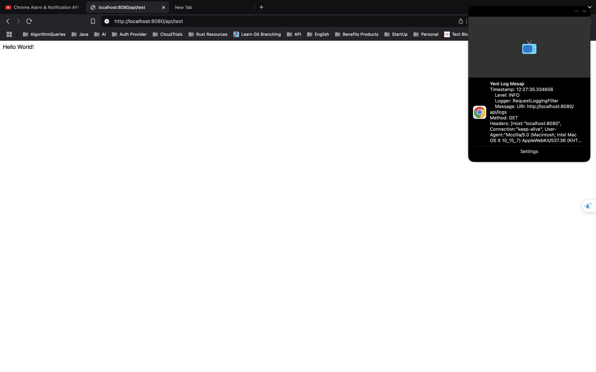
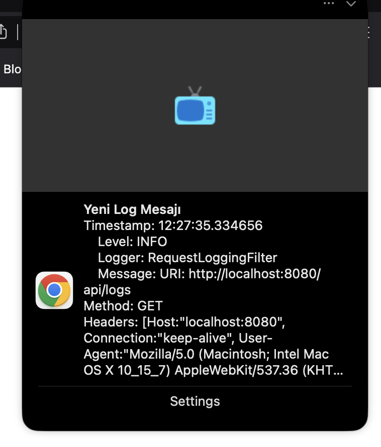

# RestLogger Extension Project

## Proje Hakkında

RestLogger Extension Project, bir web uygulamasının loglarını gerçek zamanlı olarak izlemek ve bildirimler almak için geliştirilmiş bir Chrome uzantısı ve Spring Boot tabanlı bir backend servisinden oluşmaktadır. Bu proje, özellikle geliştiricilerin ve sistem yöneticilerinin uygulama loglarını daha kolay ve etkili bir şekilde takip etmelerini sağlamak amacıyla tasarlanmıştır.

## Teknolojiler

### Frontend (Chrome Extension)

- **JavaScript**: Chrome uzantısının temel işlevselliğini sağlamak için kullanılmıştır.
- **HTML/CSS**: Kullanıcı arayüzünü oluşturmak için kullanılmıştır.
- **Chrome Extensions API**: Chrome uzantısının özelliklerini ve işlevselliğini sağlamak için kullanılmıştır.

### Backend (Spring Boot)

- **Spring Boot**: Backend servisini oluşturmak için kullanılmıştır.
- **Spring WebFlux**: Reactive programlama modeli ile asenkron ve non-blocking web uygulamaları geliştirmek için kullanılmıştır.
- **SLF4J ve Logback**: Loglama işlemleri için kullanılmıştır.
- **Reactor**: Reactive stream'leri yönetmek için kullanılmıştır.
- **Lombok**: Kodun daha temiz ve okunabilir olmasını sağlamak için kullanılmıştır.
- **Springdoc OpenAPI**: API dokümantasyonu için kullanılmıştır.

## Proje Yapısı

### ExtensionApplication

Bu dizin, Chrome uzantısının kaynak kodlarını içerir. Uzantı, logları gerçek zamanlı olarak izlemek ve bildirimler göndermek için kullanılır.

- **background.js**: Uzantının arka plan işlemlerini yönetir. Logları dinler ve bildirimler oluşturur.
- **popup.html**: Kullanıcı arayüzünü oluşturur.
- **popup.js**: Kullanıcı arayüzü ile etkileşimi yönetir.
- **manifest.json**: Uzantının yapılandırma dosyasıdır.
- **styles.css**: Kullanıcı arayüzü için stil dosyasıdır.

### RestLogger

Bu dizin, Spring Boot tabanlı backend servisinin kaynak kodlarını içerir. Bu servis, logları toplar ve gerçek zamanlı olarak istemcilere iletir.

- **RestLoggerApplication.java**: Spring Boot uygulamasının ana sınıfıdır.
- **controller**: API endpoint'lerini tanımlar.
  - **LogController.java**: Logları stream eden endpoint.
  - **TestController.java**: Test endpoint'leri.
- **filter**: HTTP isteklerini loglayan filtre.
  - **RequestLoggingFilter.java**: Gelen HTTP isteklerini loglar.
- **model**: Log modelini tanımlar.
  - **Log.java**: Log model sınıfı.
- **service**: Log işleme ve iletme işlemlerini yönetir.
  - **LogService.java**: Log işleme ve iletme servisi.
- **resources**: Uygulama yapılandırma dosyalarını içerir.
  - **application.properties**: Uygulama yapılandırma dosyası.
  - **logback-spring.xml**: Logback yapılandırma dosyası.

## Kullanım

### Backend Servisini Çalıştırma

1. Proje dizinine gidin:
   ```bash
   cd ExtensionProject/RestLogger
   ```

2. Maven wrapper kullanarak projeyi çalıştırın:
   ```bash
   ./mvnw spring-boot:run
   ```

3. Backend servisi, `http://localhost:8080` adresinde çalışacaktır.

### Chrome Uzantısını Yükleme

1. Chrome tarayıcısını açın ve `chrome://extensions/` adresine gidin.
2. Sağ üst köşedeki "Geliştirici modu"nu etkinleştirin.
3. "Paketlenmemiş uzantı yükle" butonuna tıklayın.
4. `ExtensionProject/ExtensionApplication` dizinini seçin.
5. Uzantı yüklendikten sonra, uzantı simgesine tıklayarak logları izleyebilirsiniz.

### Logları İzleme ve Bildirim Alma

1. Backend servisi çalışırken, uzantı simgesine tıklayarak logları gerçek zamanlı olarak izleyebilirsiniz.
2. Log seviyesine göre (INFO, ERROR, WARN) bildirimler alabilirsiniz.
3. Bildirimlere tıklayarak daha fazla bilgi edinebilirsiniz.

## Katkıda Bulunma

Bu projeye katkıda bulunmak isterseniz, lütfen bir pull request gönderin veya bir issue açın. Her türlü geri bildirim ve katkı memnuniyetle karşılanacaktır.

## Lisans

Bu proje MIT Lisansı ile lisanslanmıştır. Daha fazla bilgi için `LICENSE` dosyasına bakabilirsiniz.

---

Bu proje, geliştiricilerin ve sistem yöneticilerinin uygulama loglarını daha kolay ve etkili bir şekilde takip etmelerini sağlamak amacıyla geliştirilmiştir. Umarız bu proje, log yönetimi ve izleme süreçlerinizi daha verimli hale getirir.



